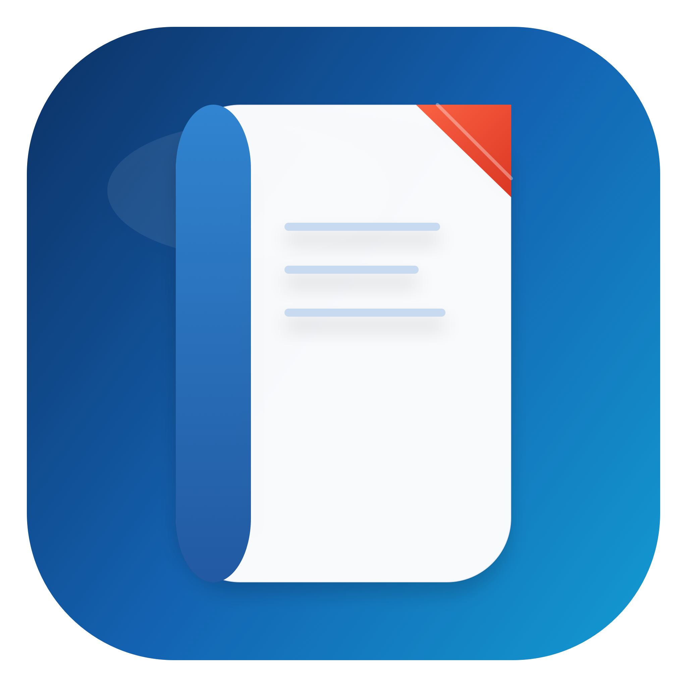
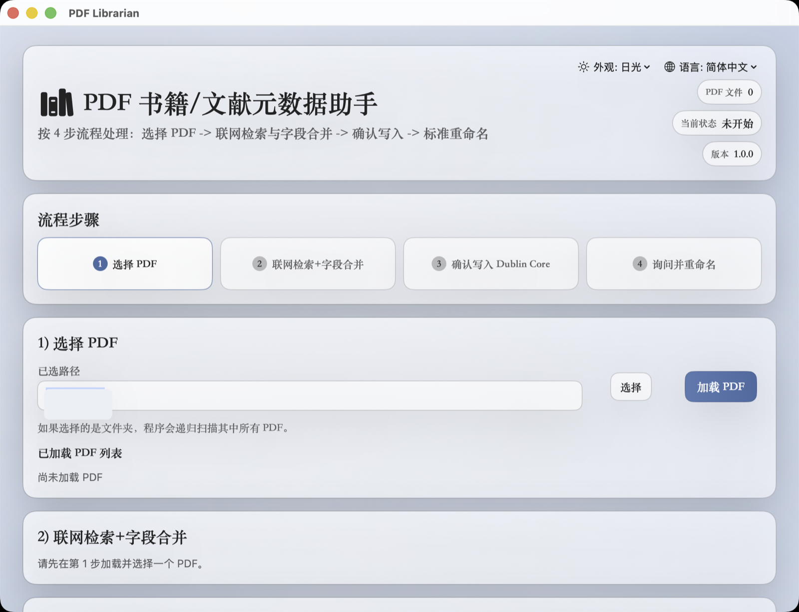
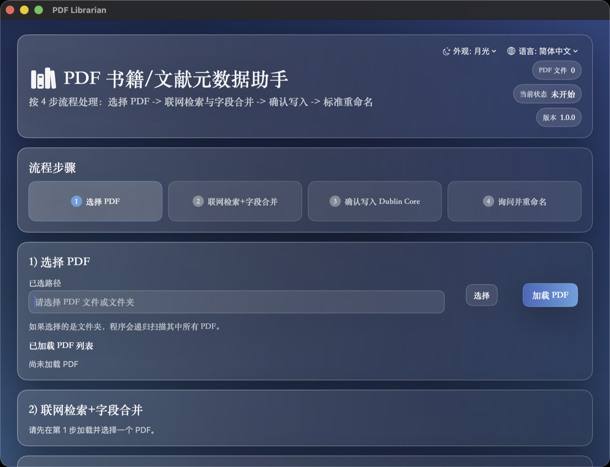

# 📚 PDF Librarian

<p align="center">
  
</p>

<p align="center">
  A macOS app for cleaning up, standardizing, and renaming book and academic paper PDFs.
</p>

<p align="center">
  <a href="https://github.com/LarryHu1988/PDFLibrarian/releases">
    
  </a>
  
  
  
  
</p>

<p align="center">
  <a href="#-中文">中文</a> •
  <a href="#-english">English</a> •
  <a href="https://github.com/LarryHu1988/PDFLibrarian/releases">Download</a>
</p>

## ✨ Highlights

- 🔎 Search metadata from filename hints and extracted PDF content
- 🌐 Merge results from `Google Books`, `Open Library`, `Douban`, and `Library of Congress`
- 🧩 Deduplicate candidates by `ISBN -> DOI -> title + author`
- 🏷️ Review and edit Dublin Core fields before writing
- ✅ Write metadata using the final confirmed values
- 📝 Generate rename suggestions from the latest written metadata
- ✍️ Edit the final file name before rename
- 🌗 Support `Daylight / Moonlight` appearance modes
- 🌍 Support a multi-language UI

## 🖼️ Interface

<table>
  <tr>
    <td align="center"><strong>Daylight</strong></td>
    <td align="center"><strong>Moonlight</strong></td>
  </tr>
  <tr>
    <td></td>
    <td></td>
  </tr>
</table>

## 📊 Feature Matrix

| Feature | Support | Notes |
| --- | --- | --- |
| Multi-source metadata lookup | ✅ | Queries `Google Books`, `Open Library`, `Douban`, and `Library of Congress` |
| Deduplication and merge flow | ✅ | Prioritizes `ISBN -> DOI -> title + author` |
| Editable Dublin Core fields | ✅ | Review and correct values before writing |
| Confirmed-value metadata write | ✅ | Uses the final edited values from step 3 |
| Rename from latest written metadata | ✅ | Keeps file names aligned with the newest metadata |
| Manual final file name edit | ✅ | Step 4 still allows a last manual adjustment |
| Daylight / Moonlight themes | ✅ | Designed for both bright and dark desktop setups |
| Chinese / English UI | ✅ | Suitable for local and global workflows |

## ❓ FAQ

**Does the app upload PDFs? / 会上传 PDF 文件吗？**  
No. The app reads PDFs you explicitly select on your Mac and sends metadata hints such as title, author, ISBN, or DOI to public metadata sources when needed. It does not upload the full PDF file.  
不会。应用只处理你在本机明确选中的 PDF，并在需要时把标题、作者、ISBN、DOI 这类检索线索发给公开元数据源，不会上传整份 PDF 文件。

**Can I edit metadata before writing? / 写入前可以手动改字段吗？**  
Yes. Step 3 is an editable review step, and the app writes exactly the values you confirm there.  
可以。第 3 步就是可编辑确认页，写入时会严格使用你确认后的字段值。

**Does rename use the latest written metadata? / 重命名会基于最新写入的元数据吗？**  
Yes. Rename suggestions are generated from the latest metadata written into the PDF, not from stale candidate values.  
会。第 4 步建议文件名基于刚写入 PDF 的最新元数据生成，不会回退到旧候选值。

**Can I change the final file name manually? / 最终文件名还能手动改吗？**  
Yes. Step 4 allows manual edits before the rename is applied.  
可以。第 4 步仍然允许手动修改最终文件名，然后再执行重命名。

**What kind of PDFs is this app for? / 这个应用适合什么 PDF？**  
It is designed for book PDFs, academic papers, and reference documents that benefit from cleaner metadata and library-friendly file names.  
它主要适合书籍 PDF、学术论文和参考资料这类需要整理元数据与文件名的文档。

## 🚀 Download

- [Latest Release](https://github.com/LarryHu1988/PDFLibrarian/releases)
- Current official version: `V1.0.0`
- Release assets: `PDFLibrarian-1.0.0.dmg` and `PDFLibrarian-1.0.0.zip`

## 🧭 Workflow

1. Select a PDF file or folder
2. Search and merge metadata candidates
3. Review, edit, and confirm Dublin Core values
4. Confirm or edit the final file name and rename the PDF

## 🏷️ Default Dublin Core Fields

`dc:title`, `dc:creator`, `dc:publisher`, `dc:date`, `dc:language`, `dc:type`, `dc:format`, `dc:identifier`, `dc:subject`

## 🛠️ Build From Source

```bash
swift build
./scripts/package_app.sh
./scripts/build_release_assets.sh
```

Build artifacts are generated in `dist/`.

## 📄 License

This repository is distributed under a proprietary, all-rights-reserved license.
See [`LICENSE`](LICENSE).

## 🇨🇳 中文

### 产品简介

PDF Librarian 是一款面向 macOS 的 PDF 元数据整理工具，适合书籍、论文和参考资料归档。

### 功能亮点

- 🔎 根据文件名和 PDF 内容提示检索元数据
- 🌐 聚合 `Google Books`、`Open Library`、`豆瓣网页搜索`、`Library of Congress`
- 🧩 按 `ISBN -> DOI -> 标题+作者` 去重并合并候选
- 🏷️ 写入前可手动编辑 Dublin Core 字段
- ✅ 按确认后的字段值写回 PDF 元数据
- 📝 基于最新写入的元数据生成建议文件名
- ✍️ 重命名时允许再次手动修改最终文件名
- 🌗 支持 `日光 / 月光` 外观
- 🌍 支持多语言界面

### 使用流程

1. 选择 PDF 文件或文件夹
2. 联网检索并合并候选元数据
3. 编辑并确认写入 Dublin Core 字段
4. 确认或修改最终文件名后执行重命名

### 默认写入字段

`dc:title`、`dc:creator`、`dc:publisher`、`dc:date`、`dc:language`、`dc:type`、`dc:format`、`dc:identifier`、`dc:subject`

### 从源码构建

```bash
swift build
./scripts/package_app.sh
./scripts/build_release_assets.sh
```

构建产物位于 `dist/`。

## 🇺🇸 English

### Overview

PDF Librarian is a macOS desktop app for cleaning up and standardizing metadata in book and academic paper PDFs.

### Key Features

- 🔎 Metadata lookup from filename and extracted PDF hints
- 🌐 Multi-source search across `Google Books`, `Open Library`, `Douban`, and `Library of Congress`
- 🧩 Deduplication and merge flow using `ISBN -> DOI -> title + author`
- 🏷️ Editable Dublin Core values before writing
- ✅ Metadata writing uses the final confirmed field values
- 📝 Rename suggestions are generated from the latest written metadata
- ✍️ Users can edit the final file name before rename
- 🌗 `Daylight / Moonlight` appearance modes
- 🌍 Multi-language UI

### Workflow

1. Select a PDF file or folder
2. Search and merge metadata candidates
3. Review, edit, and confirm Dublin Core values
4. Confirm or edit the final file name and rename the PDF

### Default Fields

`dc:title`, `dc:creator`, `dc:publisher`, `dc:date`, `dc:language`, `dc:type`, `dc:format`, `dc:identifier`, `dc:subject`
